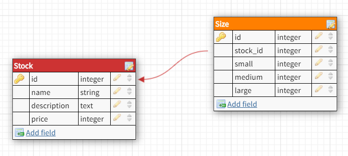

# mvp-project-1
A simple online shop interface for an independent streetwear apparel brand

## How to:
To run the app on browser, from the main project directory, cd into client and npm start

## What the app does
* Shows all items
* Gives detail on individual items on hover/click (price/description/colour)
* Allows user to add item(s) to cart
* Allows users to remove item(s) from cart

### Feature expansion
* Add product image to basket view
* Allow users to save items to cart to retrieve later
* Store inventory on back end database
* Create user account to save personal details
* Assign order history to user account
* Drop-down select menu for items to select size and/or quantity
* Client interface to add/remove/update items
* Larger amount of inventory should include some method of filtering products (i.e. t-shirts/hats/etc.)
* Submit form to go to a nominated email address?

### Userflow

* Nav bar on top of screen (shop/cart/about)
* Shop page displays all items (likely 8 max)
* On clicking an item, dedicated page will show product name, description, price, size selector(?), 'add to basket' button + back to shop
* Basket page shows items already in cart, or 'empty'
* Basket page should allow deletion of items
* About page with contact form
* Design for web & for mobile view

### Data
* Stored initially as array of objects in separate JS file
* Stock item to include:
- ID number
- name/title
- description
- price
- colour
- size(s)
- image link

## Backend not being implemented at this stage, though may try to introduce later

### Database schema

* 2x tables; 1x for stock, 1x for storing quantities of stock by size

### API routes (Not yet applicable)
* GET api/stock : returns all inventory objects
* GET api/stock/:id : returns item by ID number (when clicking on image in shop)
